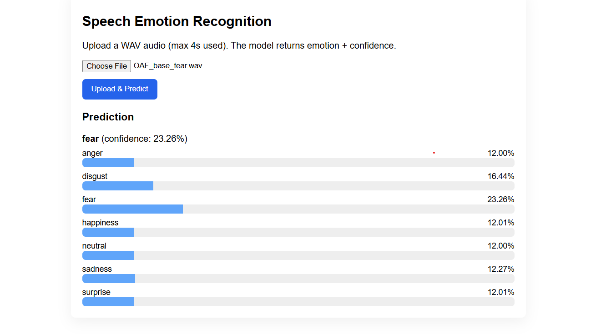

# 🎙️ Speech Emotion Recognition (FastAPI + Deep Learning)

This project is a **Speech Emotion Recognition (SER)** system that predicts human emotions from audio files (`.wav`) using a trained deep learning model.  
The backend is powered by **FastAPI**, and users can upload speech samples to get real-time emotion predictions along with confidence scores.

---

# Demo Pictures



---

## 🚀 Features
- Upload a `.wav` audio file via API or frontend.
- Automatic preprocessing (mel spectrogram generation).
- Emotion prediction using a trained **Keras** model (`model.keras`).
- Returns top emotion with a **confidence score**.
- REST API built with **FastAPI** (interactive Swagger UI at `/docs`).
- Optional frontend integration for easy testing.

---

## 🧠 Model Details
- **Input shape:** `(128, 345, 1)`  
- **Audio format:** `.wav` (mono, 4 seconds, 44100 Hz sample rate)  
- **Preprocessing:**
  - Converts audio to mel spectrogram
  - Pads shorter clips with zeros
  - Normalization & standardization applied  
- **Output layer:** Softmax probabilities  
- **Classes:**
['anger', 'calm', 'disgust', 'fear', 'happiness', 'neutral', 'sadness', 'surprise']

## ⚙️ Installation & Setup

### 1. Clone the repository
```bash
git clone https://github.com/yourusername/speech-emotion-recognition.git
cd speech-emotion-recognition

```

---
### 2. Create a virtual environment
```bash
source venv/bin/activate        # Linux / Mac
venv\Scripts\activate           # Windows
```
---
### 3. Install dependencies
```bash
pip install -r requirements.txt
```
---
### 4. Run the FastAPI server
```bash
uvicorn app:app --reload
```
### 5. Open in browser
```bash
API Docs: http://127.0.0.1:8000/docs

Web App (if enabled): http://127.0.0.1:8000
```
---
## API Usage
Endpoint: /predict

Method: POST
Description: Upload a .wav file to predict emotion.

Example (cURL)
curl -X 'POST' \
  'http://127.0.0.1:8000/predict' \
  -F 'file=@sample.wav'
```bash
Response Example:
{
  "predicted_emotion": "happiness",
  "confidence": 0.92,
  "class_probabilities": {
    "anger": 0.01,
    "calm": 0.02,
    "disgust": 0.03,
    "fear": 0.05,
    "happiness": 0.92,
    "neutral": 0.01,
    "sadness": 0.01,
    "surprise": 0.03
  }
```
###  Technologies Used

- Python 3.10+

- TensorFlow / Keras

- FastAPI

- Librosa

- NumPy

- Uvicorn

- Jinja2 (for frontend)

### 📊 Future Improvements

Add support for real-time microphone recording.

Improve noise robustness.

Deploy on cloud (Render / Hugging Face Spaces).

Add waveform and spectrogram visualizations.

## 👨‍💻 Author

Ali Ahmad

AI/ML Engineer | Deep Learning Enthusiast

📍 The Islamia University of Bahawalpur
